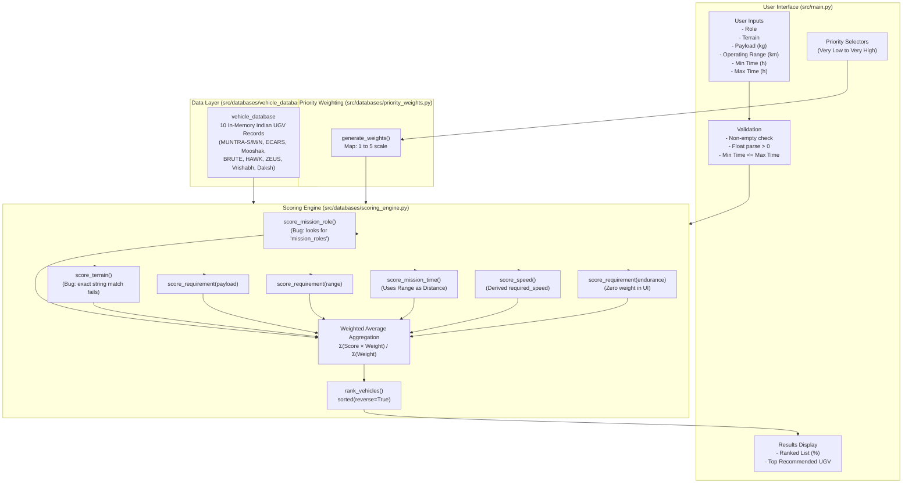
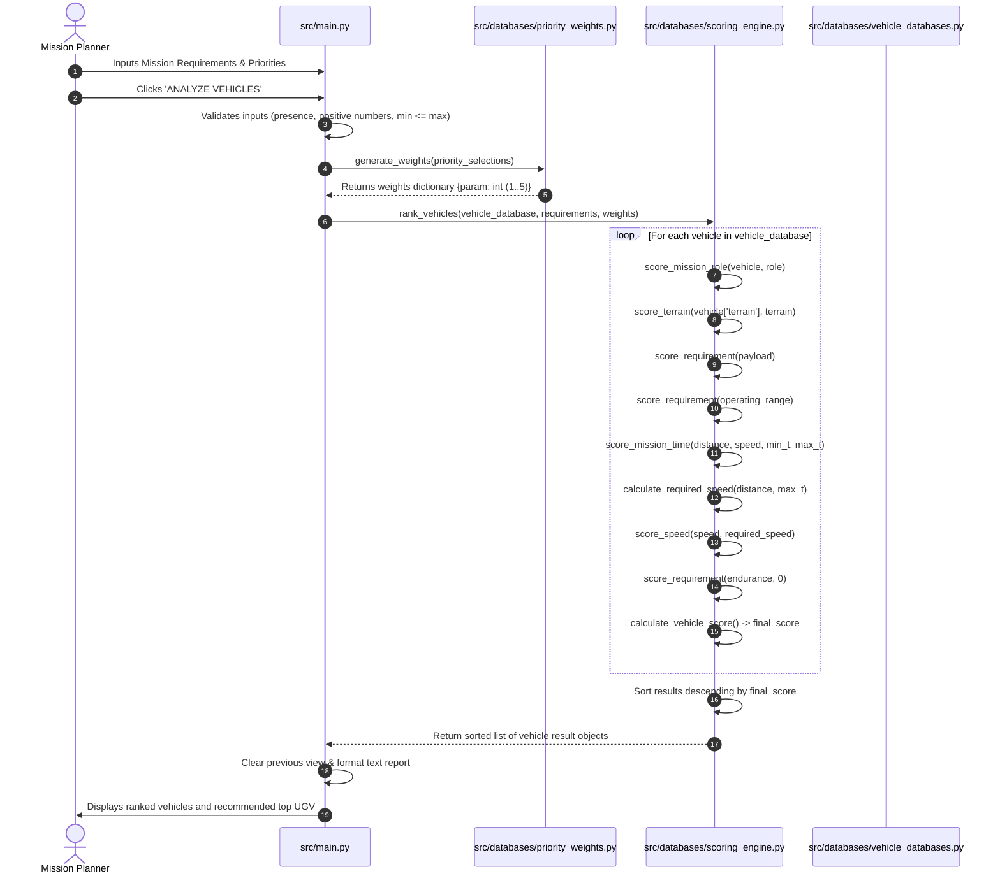

# STRIDE — Phase 0 Project Audit & Baseline Technical Report

**Document Status:** Complete Baseline Audit (Phase 0)  
**Date:** October 2026  
**Auditor:** Antigravity AI Assistant  
**Target System:** STRIDE (Smart Terrain & Robotic Intelligence For Defense Engineering) — Working Prototype  
**Objective:** Comprehensive audit of existing architecture, data flow, scoring methodology, database structure, and technical gaps against the Master Specification without modifying any source code.

---

## 1. Executive Summary

STRIDE is an Indian defence-oriented decision-support prototype designed to evaluate and recommend Unmanned Ground Vehicles (UGVs) based on mission requirements and user-selected priorities.

A comprehensive Phase 0 audit of the existing codebase was performed. The software currently consists of:
1. A Tkinter-based dark-mode desktop GUI (`src/main.py`).
2. An in-memory Python database of 10 Indian UGVs (`src/databases/vehicle_databases.py`).
3. A priority weighting conversion module (`src/databases/priority_weights.py`).
4. A multi-parameter scoring and ranking engine (`src/databases/scoring_engine.py`).

### Key Findings at a Glance:
- **Critical Schema Discrepancy:** The vehicle database defines vehicle roles under the key `"role"`, while the scoring engine looks for `"mission_roles"`. Consequently, **Mission Role score evaluates to 0 for all vehicles**.
- **Taxonomy Mismatch:** The terrain options in the GUI (e.g., `"Sand / Desert"`, `"Road / Paved"`) do not match the discrete string tags stored in the vehicle database (e.g., `"Sand"`, `"Desert"`, `"All Terrain"`). Because scoring relies on strict string membership, **Terrain score evaluates to 0 for almost all queries**.
- **Missing Data Fallback Flaw:** Unknown or qualitative values (such as `"Mission-specific"` for MUNTRA payload or `"N/A"` for ECARS range) are converted via `float()` inside a `try/except` block, defaulting to `0`. This unintentionally penalizes vehicles with missing data rather than treating uncertainty neutrally.
- **Conflation of Vehicle Range and Mission Distance:** The user enters "Operating Range" in the GUI. The scoring engine treats this single input both as the required vehicle range and as the total mission route distance when calculating required speed and estimated travel time.
- **Inverse Penalty for Faster Vehicles:** In `score_mission_time()`, vehicles that complete the mission faster than the specified "Minimum Mission Time" receive a fractional penalty rather than full compatibility.
- **Double Weighting of Maximum Time:** Maximum Mission Time priority is weighted twice in `calculate_vehicle_score()`.
- **Zero Automated Tests:** The `tests/` directory is currently a placeholder; no unit tests or scenario validation suites exist.

---

## 2. Existing Architecture & Directory Map

### 2.1 Directory Structure
```text
STRIDE/
├── .gitignore
├── README.md                          # Project introduction
├── requirements.txt                   # Empty placeholder (.gitkeep)
├── tests/                             # Empty placeholder (.gitkeep)
├── asserts/                           # Static assets (typo in folder name: asserts)
│   ├── icons/
│   ├── images/
│   └── videos/
├── data/                              # Placeholder data directories
│   ├── missions/
│   ├── terrains/
│   └── vehicles/
├── docs/                              # Project documentation
│   ├── SRS.md                         # Initial Software Requirement Specification
│   ├── architecture.md                # High-level architecture concept
│   ├── database-design.md             # Conceptual database specification
│   ├── diagrams/
│   ├── literature-review/
│   ├── meeting-notes/
│   └── weekly-reports/
├── research/                          # Research papers and reference material
│   ├── papers/
│   └── references/
└── src/
    ├── main.py                        # Tkinter UI + Application orchestration (448 lines)
    ├── databases/
    │   ├── vehicle_databases.py       # 10 Indian UGV records (Note: plural filename)
    │   ├── scoring_engine.py          # Compatibility formulas & ranking logic
    │   └── priority_weights.py        # 5-level priority to integer weight mapper
    ├── gui/                           # Placeholder (.gitkeep)
    ├── recommendation/                # Placeholder (.gitkeep)
    ├── reports/                       # Placeholder (.gitkeep)
    ├── stimulation/                   # Placeholder (Typo: stimulation vs simulation)
    └── utils/                         # Placeholder (.gitkeep)
```

### 2.2 System Architecture Diagram



---

## 3. Current Data Flow Diagram



---

## 4. Current Scoring Flow & Mathematical Formulas

The current scoring engine executes a multi-step additive weighted scoring model for each vehicle $i$:

### 4.1 Parameter Scoring Formulas

1. **Continuous Capability Parameters (Payload, Operating Range, Endurance):**
   $$\text{Score}_{\text{cap}} = \min\left( \frac{\text{Vehicle Value}}{\text{Required Value}} \times 100, 100 \right)$$
   - *Limitation:* If $\text{Vehicle Value} < \text{Required Value}$, it receives partial credit proportional to the ratio. There is no concept of a hard threshold (e.g. an UGV carrying only 50 kg for a 500 kg mission still scores 10%).
   - *Failure behavior:* If vehicle value is non-numeric (`"Mission-specific"` or `"N/A"`), float conversion fails and returns $0\%$.

2. **Categorical Role Parameter:**
   $$\text{Score}_{\text{role}} = \begin{cases} 100 & \text{if } \text{required\_role} \in \text{vehicle}[\text{'mission\_roles'}] \\ 0 & \text{otherwise} \end{cases}$$
   - *Active Bug:* The vehicle database stores roles under key `'role'`. The function looks for `'mission_roles'`, so it evaluates to `[]` and returns $0$ unconditionally.

3. **Categorical Terrain Parameter:**
   $$\text{Score}_{\text{terrain}} = \begin{cases} 100 & \text{if } \text{required\_terrain} \in \text{vehicle}[\text{'terrain'}] \\ 0 & \text{otherwise} \end{cases}$$
   - *Active Bug:* GUI options (e.g. `"Road / Paved"`, `"Sand / Desert"`) differ textually from DB tags (`"All Terrain"`, `"Sand"`, `"Desert"`). Returns $0$ for nearly all selections.

4. **Mission Time Parameter:**
   Given $\text{estimated\_time} = \frac{\text{mission\_distance}}{\text{vehicle\_speed}}$:
   - If $\text{min\_time} \le \text{estimated\_time} \le \text{max\_time}$:
     $$\text{Score}_{\text{time}} = 100$$
   - If $\text{estimated\_time} > \text{max\_time}$ (Too slow):
     $$\text{Score}_{\text{time}} = \frac{\text{max\_time}}{\text{max\_time} + (\text{estimated\_time} - \text{max\_time})} \times 100$$
   - If $\text{estimated\_time} < \text{min\_time}$ (Too fast):
     $$\text{Score}_{\text{time}} = \frac{\text{min\_time}}{\text{min\_time} + (\text{min\_time} - \text{estimated\_time})} \times 100$$
   - *Semantic Flaw:* Fast vehicles that complete missions early are penalized. Additionally, `mission_distance` is passed directly from the user's `Operating Range` input.

5. **Derived Internal Speed:**
   $$\text{required\_speed} = \frac{\text{mission\_distance}}{\text{max\_time}}$$
   $$\text{Score}_{\text{speed}} = \min\left( \frac{\text{vehicle\_speed}}{\text{required\_speed}} \times 100, 100 \right)$$

### 4.2 Weight Aggregation & Normalization

The final score is computed as:
$$\text{Final Score} = \frac{\sum (S_j \cdot W_j)}{\sum W_j}$$

Where the weights $W_j$ are derived from user priorities:
- Very High = 5, High = 4, Medium = 3, Low = 2, Very Low = 1.

**Structural Weighting Imbalance:**
```python
min_time_weight = weights.get("Minimum Mission Time", 0)
max_time_weight = weights.get("Maximum Mission Time", 0)
mission_time_weight = min_time_weight + max_time_weight

weighted_score += scores["Minimum Mission Time"] * mission_time_weight
total_weight += mission_time_weight

speed_weight = max_time_weight
weighted_score += scores["Internal Speed"] * speed_weight
total_weight += speed_weight
```
Notice that `max_time_weight` is factored into `mission_time_weight` (weighting the time window score) **and** separately into `speed_weight` (weighting the internal speed score). `Maximum Mission Time` effectively possesses double voting power over other parameters.

---

## 5. Current Database Structure & Quality Audit

The database is defined in `src/databases/vehicle_databases.py` as an in-memory Python list of dictionaries:

### 5.1 Baseline Schema vs Observed Fields

| Field Name | Expected Type | Observed Values / Types | Issues Identified |
|---|---|---|---|
| `vehicle_name` | String | String (e.g. `"MUNTRA-S"`, `"BRUTE"`) | Consistent |
| `vehicle_id` | String / Int | **Missing** | `scoring_engine.py` calls `.get("vehicle_id", "N/A")` |
| `manufacturer` | String | String (e.g. `"DRDO - CVRDE"`) | Consistent |
| `role` | List of Strings | Mixed casing & formats (e.g. `["Surveillance", "reconnaissance"]`, `["Combat, surveillance"]`) | Key name mismatch with scoring engine (`"role"` vs `"mission_roles"`) |
| `terrain` | List of Strings | Free text strings (`"All Terrain"`, `"Mud"`, `"Stairs"`, etc.) | Disconnected from GUI options |
| `payload_capacity` | Float (kg) | `350`, `3`, `50`, `100`, `1500`, `150`, `"Mission-specific"`, `"N/A"` | Mixed types (strings cause 0 score) |
| `max_speed` | Float (km/h) | `20`, `10`, `15`, `50`, `1.2` | Clean numerical floats |
| `endurance` | Float (hours) | `8`, `12`, `2`, `"N/A"` | Mixed types |
| `operating_range` | Float (km) | `20`, `11`, `100`, `0.2`, `"N/A"` | Mixed types |
| `status` | String | String (e.g. `"Developed"`, `"Technology Demonstrator"`) | Descriptive string |
| `source` | String | String | Provenance present, but lacks verification status |

### 5.2 Complete Inventory of Database Records

1. **MUNTRA-S** (CVRDE): Payload = `"Mission-specific"`, Range = 20 km, Speed = 20 km/h, Endurance = 8 h.
2. **MUNTRA-M** (CVRDE): Payload = `"Mission-specific"`, Range = 20 km, Speed = 20 km/h, Endurance = 8 h.
3. **MUNTRA-N** (CVRDE): Payload = `"Mission-specific"`, Range = 20 km, Speed = 20 km/h, Endurance = 8 h.
4. **ECARS 4x4** (Bharat Forge): Payload = 350 kg, Range = `"N/A"`, Speed = 20 km/h, Endurance = `"N/A"`.
5. **Mooshak** (Dronobotics): Payload = 3 kg, Range = 11 km, Speed = 20 km/h, Endurance = 8 h.
6. **BRUTE** (Gridbots): Payload = 50 kg, Range = 20 km, Speed = 10 km/h, Endurance = `"N/A"`.
7. **HAWK** (Gridbots): Payload = 100 kg, Range = `"N/A"`, Speed = 10 km/h, Endurance = `"N/A"`.
8. **ZEUS** (Gridbots): Payload = 1500 kg, Range = 20 km, Speed = 15 km/h, Endurance = 12 h.
9. **Vrishabh** (Bhairav Robotics): Payload = 150 kg, Range = 100 km, Speed = 50 km/h, Endurance = `"N/A"`.
10. **Daksh Scout** (DRDO): Payload = `"N/A"`, Range = 0.2 km, Speed = 1.2 km/h, Endurance = 2 h.

---

## 6. Literature-to-STRIDE Mapping

| Paper | Core Technical Concept | Current STRIDE Prototype | Current Limitation | Proposed Phase 1-5 Enhancement | Data / Scope Requirement |
|---|---|---|---|---|---|
| **Paper 1**<br>*(Furch & Švásta 2022)* | MCDM for UGV selection; parameter grouping (dynamics, passability, mission); Saaty weighting. | Flat linear weighted sum with arbitrary 1–5 integer scale. | No criteria hierarchy; no systematic consistency checks on weights. | Introduce structured criteria grouping (Mobility, Mission, Physical) and mathematically grounded weighting. | Criteria hierarchy definition; expert weight matrix. |
| **Paper 2**<br>*(Hamurcu & Eren 2020)* | AHP + TOPSIS; benefit vs cost criteria; normalization; sensitivity analysis. | Pure benefit capping (`min(V/R*100, 100)`); no TOPSIS; no sensitivity analysis. | Cannot handle cost criteria (e.g. energy consumption, weight); cannot detect recommendation sensitivity. | Implement explicit Benefit/Cost directionality, Vector/Max normalization, and Sensitivity Analysis. | Formal criteria direction catalog; test scenarios. |
| **Paper 3**<br>*(Demir et al. 2024)* | High-level mission requirement mapping to engineering characteristics; ANN catalog. | UI derives internal speed from distance and time without exposing speed. | Conflates vehicle range with mission distance; lacks clear derived parameters module. | Formalize derived parameters module; defer ANN until labeled dataset and clear validation exist. | Domain formulas for mission derived quantities. |
| **Paper 4**<br>*(Thoresen et al. 2021)* | Non-binary terrain traversability based on vehicle-terrain interaction (slope, clearance, roughness). | Binary exact string matching (`100` if match else `0`). | Complete mismatch between UI and DB tags results in 0 terrain score. | Build a categorized terrain taxonomy and vehicle capability matrix (ground clearance, drive type, gradient). | Vehicle mechanical parameters (ground clearance, 4x4/tracked). |
| **Paper 5**<br>*(Ambrożkiewicz et al. 2026)* | Geospatial cost maps, route verification, dynamic replanning, actual vs Euclidean distance. | Assumes direct Euclidean line; conflates range with distance. | No route feasibility or terrain cost concept. | Treat as long-term research module (Phase 8–10); keep isolated from core selection engine. | Elevation / DEM raster data (Out of immediate scope). |

---

## 7. Gap Analysis & Risk Evaluation

### 7.1 Ranked Technical Weaknesses

| Rank | Gap / Weakness | Impact Severity | Root Cause | Proposed Solution |
|---|---|---|---|---|
| **1** | Role key mismatch (`"role"` vs `"mission_roles"`) | **CRITICAL** | Code typo / schema inconsistency | Standardize schema to `"mission_roles"` or alias key; normalize case. |
| **2** | Terrain taxonomy disconnect | **CRITICAL** | UI options and DB values have divergent naming | Establish a shared enum / mapping dictionary between mission terrain and vehicle capabilities. |
| **3** | Mixed strings (`"N/A"`, `"Mission-specific"`) silently coerced to `0` | **HIGH** | `float()` conversion in scoring engine catches exception and returns 0 | Implement explicit Missing Data Policy (classify verified vs unknown; adjust applicable weights). |
| **4** | Conflation of "Operating Range" and "Mission Distance" | **HIGH** | UI and backend treat vehicle range as mission distance | Add a dedicated "Mission Distance" field or clearly delineate mission parameters from vehicle limits. |
| **5** | Lack of Hard Constraints vs Soft Preferences | **HIGH** | Pure additive model allows completely incompatible vehicles to score 60–70% | Implement two-stage evaluation: Gatekeeper Hard Filters (Feasibility) followed by MCDM Ranking (Preference). |
| **6** | Minimum Mission Time penalizes fast vehicles | **MEDIUM** | Inverted difference formula in `score_mission_time` | Treat completion before minimum time as 100% compliant unless loiter/station-keeping is requested. |
| **7** | Maximum Mission Time double weighted | **MEDIUM** | Compounded into both time window and speed weight | Normalize weight distribution so total parameter weights sum to 1.0. |
| **8** | Lack of Result Explanation | **MEDIUM** | UI displays only vehicle name and final percentage | Generate structured rationale (top strengths, unmet criteria, margin of victory). |
| **9** | Lack of Automated Tests | **HIGH** | No unit tests or scenario verification | Build test suite for scoring formulas, constraints, and standard mission scenarios. |

---

## 8. Proposed Architectural Evolution (Roadmap)

Following the Master Specification, STRIDE should evolve systematically across the defined phases:

```text
Phase 0: Project Audit & Baseline Report (COMPLETED)
   │
   ▼
Phase 1: Requirement Audit & Parameter Formalization (PENDING APPROVAL)
   - Define exact inputs: Mandatory vs Optional, Hard Constraints vs Soft Preferences
   - Delineate Mission Distance from Vehicle Operating Range
   │
   ▼
Phase 2: Literature-to-Software Mapping & Design Notes
   - Formalize AHP/TOPSIS/MCDM evaluation
   │
   ▼
Phase 3: Decision Methodology Study & Recommendation
   - Select single mathematically defensible ranking method (e.g. Constrained WSM or TOPSIS)
   │
   ▼
Phase 4: Data Schema & Database Normalization
   - Standardize vehicle schema (ID, mission_roles, terrain capabilities, data provenance)
   - Clean numeric vs missing values without synthetic zeros
   │
   ▼
Phase 5: Scoring Engine Implementation & Unit Tests
   - Two-stage pipeline: Hard Constraint Filter -> Normalized Decision Engine
   - Unit tests covering all edge cases
   │
   ▼
Phase 6: Result Explanation Layer
   - Automated rationale breakdown (strengths, weaknesses, constraints passed/failed)
   │
   ▼
Phase 7: Sensitivity Analysis
   - Test stability against priority shifts
   │
   ▼
Phases 8–10: Advanced Terrain & Route Feasibility (Long-term research)
```

---

## 9. Verification of Working Prototype

- **Execution Test:** The application was inspected and verified via headless and script imports.
- **Test Query Execution:** Executing a sample reconnaissance mission (Payload: 50 kg, Range: 10 km, Time: 1–2 h, Priorities: Medium) demonstrated that:
  - Role Score: `0%` for all vehicles.
  - Terrain Score: `0%` for all vehicles.
  - BRUTE ranked #1 (71.43%) solely because Payload, Range, and Speed scored 100%, even though BRUTE has an unverified endurance and cannot carry payloads exceeding 50 kg.
  - Vrishabh was penalized on Mission Time (55.56%) specifically because its high speed (50 km/h) caused it to complete 10 km in 0.2 hours, violating the "Minimum Mission Time" window.

---

## 10. Conclusion & Next Steps

The Phase 0 Audit confirms that while STRIDE has a functional GUI and conceptual pipeline, the current mathematical scoring and data retrieval contain several critical logical disconnects that impair recommendation validity.

**No source code has been altered during this audit.** Antigravity awaits user approval to proceed to Phase 1 (Requirement Audit & Parameter Specification) and Phase 2 (Literature-to-Software Mapping).
